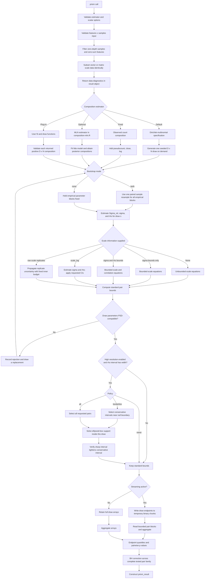

# prism

`prism` estimates identification regions and confidence intervals for absolute
log-covariances from compositional observations and optional scale information.
It is an R package: code under `R/` defines package functions; analysis and
benchmark scripts are intentionally kept outside the package.

## Statistical target

For feature `d`, write absolute log abundance as

```text
log W_d = log P_d + U,
```

where `P_d` is relative abundance and `U` is log total scale. For pair `(i,j)`,

```text
Cov(log W_i, log W_j)
  = Sigma_rel[i,j] + sigma^2
    + sigma * (s_i * rho_i + s_j * rho_j),
```

where:

- `Sigma_rel` is the covariance of sample log compositions;
- `sigma = SD(U)`;
- `s_d = sqrt(Sigma_rel[d,d])`;
- `rho_d = Cor(log P_d, U)`.

The target is the population absolute log-covariance. `Sigma_rel` and any
sample-level scale summaries are estimated from observed samples. The package
reports identification bounds because the absolute covariance is generally not
point identified from compositions alone.

## Minimal use

```r
library(prism)

fit <- prism(
  counts = count_matrix,
  composition = prism_composition_dirichlet(
    pseudocount = 0.5,
    concentration = 1
  ),
  bootstrap = TRUE,
  S = 1000,
  sigma_L = 0.2,
  sigma_U = 0.8,
  seed = 1
)

fit
fit$pairwise
fit$diagnostics
```

`bootstrap` accepts `"none"` and `"both"`. Logical `FALSE` and `TRUE` remain
aliases for those modes. `"both"` is a paired sample bootstrap: one resampled
sample index is applied to the count composition and its matched scale
measurement, and all empirical covariance parameters are re-estimated from
that draw. The former `"composition"` and `"scale"` hybrid modes are deprecated
and unsupported because independently resampled parameter blocks need not
define a positive-semidefinite joint covariance. Attempted, accepted, and
rejected counts; acceptance and rejection fractions; replacement counts;
attempts-per-draw summaries; and reason counts and fractions are returned in
`fit$diagnostics$sampling`.

The count matrix must be features by samples. A pseudocount is added before a
logarithm or before constructing Dirichlet parameters. A zero pseudocount is
accepted only when it cannot produce a zero logarithm or a zero Dirichlet
parameter.

## Call flow



High-resolution refinement is performed inside each selected bootstrap draw.
It is not applied after final confidence endpoints have already been computed.
An audited external screening step may pass a two-column integer matrix through
`high_resolution_pair_index`. Those requested pairs replace automatic
policy-based selection, but PRISM still regenerates the seeded stochastic
draws, refines each requested pair within each draw, and recomputes BH across
the complete pair family. The indices refer to the retained feature order after
PRISM filtering.

## Composition estimators

The default is:

```r
prism_composition_dirichlet(pseudocount = 1, concentration = 1)
```

This uses independent sample-level Dirichlet distributions with parameters

```text
concentration * (counts[, n] + pseudocount).
```

Fixed observed compositions are requested explicitly:

```r
prism_composition_fixed(pseudocount = 0.5)
```

MLN is optional and isolated from the PRISM estimator:

```r
prism_composition_mln(
  tune_draws = 200,
  max_hessian_gb = 4
)
```

It requires `fido`. It is not the default and PRISM does not currently rely on
it for its standard composition estimator.

A custom estimator has two functions:

```r
my_estimator <- prism_composition_estimator(
  name = "my_model",
  fit = function(counts, n_draws, seed, verbose) {
    # Return fitted state.
  },
  draw = function(fit, draw) {
    # Return one finite, positive D x N composition matrix.
  }
)
```

Every custom draw is checked and reclosed before covariance estimation. The
plug-in is responsible for the statistical validity and uncertainty calibration
of its draws.

## Scale regimes

The package selects equations from the information supplied:

| Information | Regime | Result |
|---|---|---|
| no scale information | unbounded scale | finite lower bound, infinite upper bound |
| `sigma_L`, `sigma_U` | bounded scale | closed-form sharp bounds |
| sigma bounds plus fixed rho | fixed correlation | closed-form sharp bounds after PSD compatibility check |
| sigma bounds plus rho intervals | bounded correlation | fast conservative standard bounds |
| previous row plus `high_resolution=TRUE` | bounded correlation | sharp numerical bounds for selected pairs |
| sample-level `scale_log` | estimated sigma and rho | point or bounded values according to `scale_log_ci_level` |
| raw scale vector or replicates | propagated scale uncertainty | draw-level sigma and rho intervals |

Supplying rho bounds without sigma bounds is an error. Sigma bounds are checked
against `[0, Inf)` and rho bounds against `[-1, 1]`. Fixed rho values must be
compatible with the positive-semidefinite relative covariance geometry. A
genuine rho interval must contain at least one single, joint rho vector in the
global ellipsoid-box intersection; satisfying each coordinate or feature pair
separately is not enough.

For sample-level `scale_log`, the empirical same-draw rho is retained as a
feasibility witness and each Fisher-z interval is forced to contain that point
estimate. For raw replicate-scale uncertainty, a witness is used only when one
actual inner draw lies inside every reported marginal rho interval. Otherwise,
PRISM certifies the full intersection numerically. Rank-deficient covariance
matrices are supported; CVXR is needed only when neither a valid witness nor a
rho box containing zero resolves a rank-deficient feasibility check.

## Result object

`prism()` returns a `prism_result` with:

- `ci_lower`, `ci_upper`: symmetric absolute-covariance CI endpoint matrices;
- `point_lower`, `point_upper`: deterministic identification endpoints, or
  `NULL` for stochastic analyses;
- `pairwise`: off-diagonal tested pairs and endpoint, p-value, q-value fields;
- `pairwise_rel`: relative covariance estimates and intervals, including the
  diagonal;
- `rel_draws`: optional relative-covariance draws;
- `diagnostics`: data, scale, composition, high-resolution, and simulation
  diagnostics;
- `parameters`: effective estimator and computational settings;
- `mln_fit_object`: optional only when requested in an MLN estimator.

No plot is created by `prism()`. The only package plotting functions are:

```r
plot_high_resolution_ci_distribution(fit, delta = 0.1)
plot_high_resolution_near_zero_changes(fit, delta = 0.1)
```

The first plots lower endpoints in red and upper endpoints in blue across all
tested pairs, with dashed null thresholds. The second contains only refined
pairs and overlays conservative gray intervals with sharp black intervals.
Both return ggplot objects; the caller decides whether and where to save a PDF.

## Computational behavior

For `D` features, `N` samples, and `S` draws:

- relative covariance computation is approximately `O(S * D^2 * N)`;
- all off-diagonal output necessarily has `O(D^2)` size;
- non-streamed endpoint arrays require `O(S * D^2)` memory;
- streamed endpoints use temporary binary files and bounded pair blocks;
- default composition draws use `O(D * N)` memory through draw-on-demand;
- raw-scale propagation uses `scale_uncertainty_draws`, independent of `S`,
  avoiding quadratic growth in `S`;
- streamed bounds combine off-diagonal and diagonal requests so global rho-box
  feasibility is certified once per draw;
- high-resolution cost scales with refined pairs, draws, matrix rank, and conic
  solver behavior.

Set `return_rel_draws=TRUE` only when needed because the requested returned
matrix itself requires `O(S * D^2)` memory.

Set `return_bound_draws=TRUE` to retain the accepted draw-level lower and upper
off-diagonal covariance bounds. They are returned as the two `S x choose(D, 2)`
matrices in `pairwise_bound_draws`, with columns aligned to `pairwise`. For
example, a central 90% outer interval can be reconstructed with the 5th
percentile of `lower` and the 95th percentile of `upper`. This opt-in output
also requires `O(S * D^2)` memory; with `S = 2000` and `D = 90`, the two
double-precision matrices occupy about 128 MB before serialization.

## Principal failure modes

- zeros with a zero pseudocount;
- noninteger values supplied as counts;
- fewer than two valid samples or features after filtering;
- rho information without sigma information;
- infeasible fixed correlations or empty ellipsoid-box intersections;
- excessive rejection when independently bootstrapped parameter blocks are
  recombined;
- too few valid Monte Carlo draws;
- custom composition draws with invalid dimensions or values;
- ill-conditioned or excessively large optional MLN fits;
- unavailable CVXR solver for high-resolution refinement or an unresolved
  rank-deficient rho-box feasibility check.

The conclusion should be reconsidered if composition draws are miscalibrated,
scale bounds are not scientifically defensible, bootstrap samples are not
exchangeable, or numerical refinement fails its interval-tightening check.
